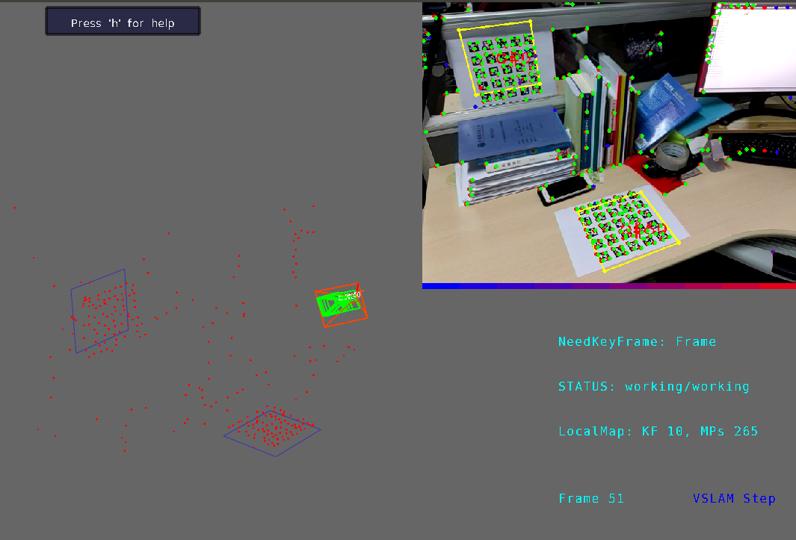

# gui3d for vslam
 - **Usage**  
  please refer [gui.h][3] and demo.cpp  
  [exec] [scene.txt]  
  example:  
  ` gui3d_demo ./data/scene.txt`
 - **Figure**   
  
 - **Dependency**  
  [wxWidgets 2.9+][1]  
  [mrpt1.5+][2]
    - sudo add-apt-repository ppa:joseluisblancoc/mrpt-1.5
    - sudo apt-get update  
    - sudo apt-get install libmrpt-common mrpt-apps  `

  [1]: https://wxwidgets.org/downloads/
  [2]: https://www.mrpt.org/download-mrpt/
  [3]: ./inc/gui3d/gui.h
